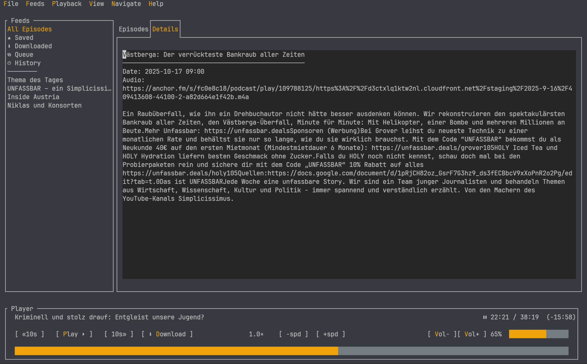
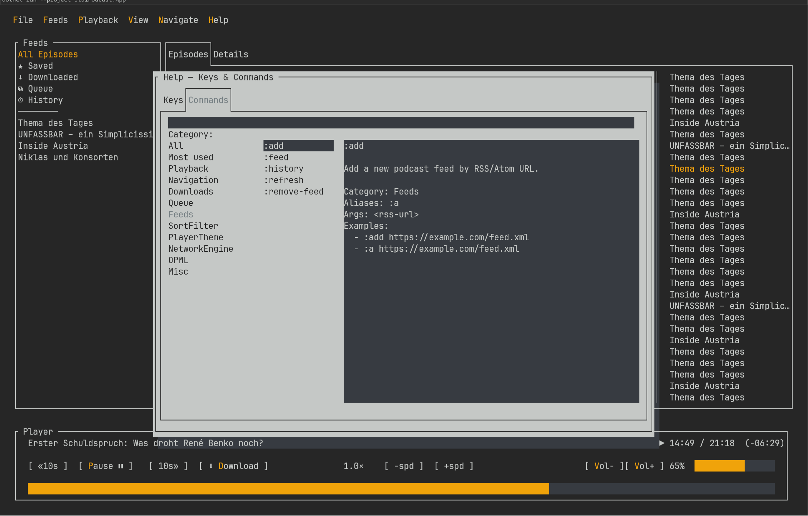
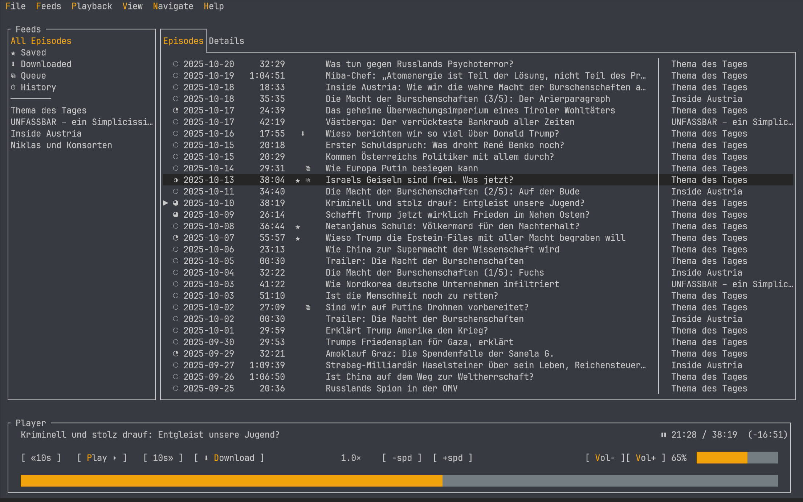

<p align="center">
 
</p>

<p align="center">
  <b>Podcasts in any terminal. Fast, clean, offline. </b>
</p>

<p align="center">
  <!-- Badges: replace with real links -->
  <a href="https://github.com/timkicker/podliner/actions">
    
  </a>
  <a href="https://github.com/timkicker/podliner/releases/latest">
    
  </a>
  <a href="LICENSE">
    
  </a>
  
</p>

---

## Table of Contents
- [Why podliner?](#why-podliner)
- [Screenshots](#screenshots)
- [Install (stable releases)](#install-stable-releases)
- [Quick start](#quick-start)
- [Migrate from other players (OPML)](#migrate-from-other-players-opml)
- [gPodder sync](#gpodder-sync)
- [Commands (essentials)](#commands-essentials)
- [Configuration & data](#configuration--data)
- [Audio engines](#audio-engines)
- [FAQ / Troubleshooting](#faq--troubleshooting)
- [Contributing](#contributing)
- [Bug reports, logs & roadmap](#bug-reports-logs--roadmap)
- [License & credits](#license--credits)

---

## Why podliner? 

- **Keyboard-first & mouse-friendly.** Full mouse support (click, select, scroll) with fast TUI feedback.
- **Vim keys & commands.** Familiar navigation (`j/k`, `gg/G`, `dd` for remove from queue, `/` to search) plus concise colon-commands (`:add <url>`, `:queue`, `:play`, `:export-opml`, `:import-opml`).
- **Sync progress and subscriptions** Via the gpodder api
- **Offline-ready.** Download episodes, resume where you left off, manage a queue.
- **Easy migration.** OPML import/export to move subscriptions between players.
- **Cross-platform.** Single-file builds for Linux, macOS, and Windows.
- **Engine choice.** Works with mpv, ffplay (FFmpeg), or VLC where available.

> No telemetry. Config lives in your user profile. All local.


## Screenshots
<p align="center">
  
  
</p>
<p align="center">
  
</p>


## Install (stable releases)

### Linux
```bash
bash <(curl -fsSL https://github.com/timkicker/podliner/releases/latest/download/install.sh)
```
Or via the [AUR](https://aur.archlinux.org/packages/podliner-bin): `yay -S podliner-bin`

### macOS
```bash
bash <(curl -fsSL https://github.com/timkicker/podliner/releases/latest/download/install-macos.sh)
```

### Windows (Powershell)

Via [winget](https://winstall.app/apps/TimKicker.Podliner):
```powershell
winget install --id=TimKicker.Podliner  -e
```

Via installer:
```powershell
irm https://github.com/timkicker/podliner/releases/latest/download/install.ps1 | iex
```

> Looking for system-wide install, uninstall, pruning, or checksum verification? See the [FAQ](#faq--troubleshooting).


## Migrate from other players (OPML)

Most podcast players support **OPML** export/import.

- **Export** your subscriptions from the old player as an `.opml` file (e.g. `subscriptions.opml`).
- In **podliner**, open the **Import OPML** action and select that file.
- To **export** your current subscriptions from podliner, use **Export OPML**. It writes to your **Documents** folder as:
  - Linux/macOS: `~/Documents/podliner-feeds.opml`
  - Windows: `%USERPROFILE%\Documents\podliner-feeds.opml`
- If you prefer to drop files in place, podliner stores its config here:
  - Linux/macOS: `${XDG_CONFIG_HOME}/podliner` or `~/.config/podliner`
  - Windows: `%APPDATA%\podliner`


## gPodder sync

Podliner can sync your subscriptions and play history with any **gPodder API v2** compatible server, including [gpodder.net](https://gpodder.net) (public, free), Nextcloud with the gPodder app, or any self-hosted instance.

**Quick start**
```
:sync login https://gpodder.net <username> <password>
:sync          ← pull + push (full sync)
:sync auto on  ← sync automatically on startup and exit
```

**Common commands**

| Command | Description |
|---------|-------------|
| `:sync login <server> <user> <pass>` | Log in and store credentials |
| `:sync` | Full sync (pull then push) |
| `:sync push` | Upload subscription changes and play history |
| `:sync pull` | Download subscription changes |
| `:sync status` | Show sync state, device, pending actions |
| `:sync auto on\|off` | Toggle auto-sync |
| `:sync logout` | Remove credentials |
| `:sync help` | In-app guide |

Credentials are stored in the OS keyring when available (libsecret on Linux, Keychain on macOS, Credential Store on Windows), with a plaintext fallback in `gpodder.json` if the keyring is unavailable.

## Commands (essentials)
> Full help browser: `:h`  |  Full list: see [COMMANDS](./COMMANDS.md)

**Playback**
- Enter: play selected
- Space: pause/resume
- Left/Right: seek 10s backward/forward
- [: slower  | ]: faster

**Navigation & filters**
- j / k: move down / up
- gg / G: jump to top / bottom
- / : search in current list
- f : toggle “unplayed only”

**Downloads & queue**
- d : download or show status
- :queue : switch to queue view
- :play-next / :play-prev : next/previous in queue

**Feeds**
- :add <url> : add feed
- :feed all|saved|downloaded|history|queue : switch view

**Misc**
- t : toggle theme
- q : quit
- :w / :wq : save / save & quit


## Configuration & data

- **Config**:
  - Linux: `$XDG_CONFIG_HOME/podliner/` (fallback: `~/.config/podliner/`)
  - macOS: `$XDG_CONFIG_HOME/podliner/` (fallback: `~/.config/podliner/`)
  - Windows: `%APPDATA%\podliner\`
- **Logs**:
  - Linux: `$XDG_STATE_HOME/podliner/logs/` (fallback: `~/.local/state/podliner/logs/`)
  - Windows: `%LOCALAPPDATA%\podliner\logs\`
  - File pattern: `podliner-.log` (daily)
  - Example: `…/podliner/logs/podliner-YYYYMMDD.log`
- **Downloads**: {{IF APPLICABLE: path or “same as configured in app”}}
- **OPML**: imports/exports under [Migrate from other players (OPML)](#migrate-from-other-players-opml)

> Back up `appsettings.json` and `library.json` to migrate settings and library to another machine.


## Audio engines
podliner can use different players:
- **mpv** (recommended)
- **ffplay** (part of ffmpeg)
- **VLC** (via LibVLC; Windows support included with `VideoLAN.LibVLC.Windows`)
- **Media Foundation**; built in (Windows only) and used as fallback when VLC or MPV are not available.

Install examples:
- Debian/Ubuntu: `sudo apt-get install -y mpv ffmpeg`
- Fedora: `sudo dnf install -y mpv ffmpeg`
- Arch: `sudo pacman -S --needed mpv ffmpeg`
- macOS: `brew install mpv ffmpeg` *(if you use Homebrew)*
- Windows: download mpv or rely on VLC package as configured.

Engine selection & fallback:
- Default is `auto` (prefer local download if available; else remote if online).
- You can switch engines from via command `:engine vlc|mpv|ffplay|mediafoundation `

## FAQ / Troubleshooting

### "No audio engine found”

- Install one of: **mpv**, **ffplay** (ffmpeg), or **VLC**. See [Audio engines](#audio-engines).

### System-wide install?  
- Linux/macOS: add `--system` to the install command.  
- Windows (PowerShell): run `Install-Podliner -System` after the bootstrap line.

### Update / Uninstall / Prune
- Update to latest stable: re-run the install command for your OS.  
- Uninstall (Linux):
  ```bash
  bash <(curl -fsSL https://github.com/timkicker/podliner/releases/latest/download/install.sh) --uninstall
  ```
- Uninstall (macOS):
  ```bash
  bash <(curl -fsSL https://github.com/timkicker/podliner/releases/latest/download/install-macos.sh) --uninstall
  ```
- Uninstall (Windows, PowerShell):
  ```powershell
  irm https://github.com/timkicker/podliner/releases/latest/download/install.ps1 | iex
  Uninstall-Podliner
  ```
- Prune old versions (keep active): use `--prune` on Linux/macOS or `Prune-Podliner` on Windows.

### Verify checksums

```bash
# Download checksums (stable)
curl -fsSLO https://github.com/timkicker/podliner/releases/latest/download/SHA256SUMS

# Example: verify Linux x64 tarball
curl -fsSLO https://github.com/timkicker/podliner/releases/latest/download/podliner-linux-x64.tar.gz
grep 'podliner-linux-x64.tar.gz$' SHA256SUMS | sha256sum -c -
```

### podliner: command not found
Add install path to `PATH`:

- Linux: `export PATH="$HOME/.local/bin:$PATH"` (in `~/.bashrc` / `~/.zshrc`)
- macOS: `export PATH="$HOME/bin:$PATH"` (in `~/.zprofile` / `~/.zshrc`)
- Windows: ensure `%LOCALAPPDATA%\Microsoft\WindowsApps` is on PATH

### Reset config
Quit, then move the config directory away (see [Configuration & data](#configuration--data)), restart to re-initialize.


## Contributing
I welcome all focused PRs.

Please take a look at [ROADMAP.md](./ROADMAP.md)

**Local dev:**
```bash
dotnet build
dotnet run --project StuiPodcast.App
```

**Guidelines (short):**
- C# with `nullable` enabled; keep logging via Serilog.
- Prioritize robustness and UX over features.

**PR flow:**
- Fork → branch → PR to `main`

## Bug reports, logs & roadmap
When filing an issue, please include:
- `podliner --version` output (shows exact version + RID)
- OS + architecture (e.g., `linux-x64`, `osx-arm64`, `win-x64`)
- Steps to reproduce (short and precise)
- **Logs**: attach the most recent file from `logs/` next to the binary (pattern `podliner-*.log`)  
  Example: `…/podliner/logs/podliner-20250101.log`

Security-sensitive issues: contact tim@kicker.dev.  


## License and credits

- License: [GPLv3](LICENSE)

**Libraries used**
- [Terminal.Gui](https://github.com/migueldeicaza/gui.cs) - TUI framework
- [Serilog](https://serilog.net/) and [Serilog.Sinks.File](https://github.com/serilog/serilog-sinks-file) - logging
- [AngleSharp](https://anglesharp.github.io/)- HTML parsing
- [CodeHollow.FeedReader](https://github.com/codehollow/FeedReader) - RSS/Atom parsing
- [Microsoft.Data.Sqlite](https://learn.microsoft.com/dotnet/standard/data/sqlite/) - SQLite provider
- [LibVLCSharp](https://github.com/videolan/libvlcsharp) - VLC bindings
- [VideoLAN.LibVLC.Windows](https://www.nuget.org/packages/VideoLAN.LibVLC.Windows)- LibVLC binaries for Windows
- [NAudio](https://github.com/naudio/NAudio)- Windows audio helpers (Media Foundation)

**Engines and tools**
- [VLC](https://www.videolan.org/) - media engine (via LibVLC)
- [mpv](https://mpv.io/) - media engine (optional)
- [FFmpeg / ffplay](https://ffmpeg.org/) - tools and fallback playback

